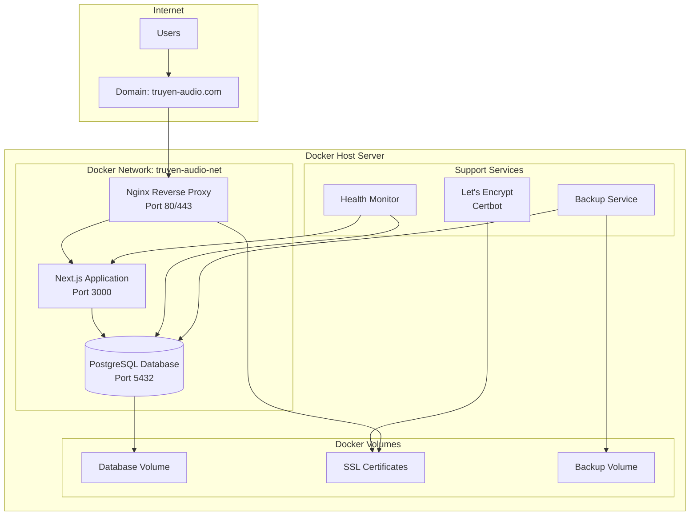

# Design Document: Docker Deployment

## Overview

Thiết kế hệ thống containerization và deployment cho ứng dụng truyen-audio sử dụng Docker, với mục tiêu tạo ra một môi trường production ổn định, bảo mật và có khả năng mở rộng. Hệ thống sẽ bao gồm multiple containers được orchestrated bởi Docker Compose, với Nginx reverse proxy, SSL termination, và automated backup system.

### Key Design Goals

- **Containerization**: Đóng gói ứng dụng Next.js và PostgreSQL database trong separate containers
- **Security**: Implement SSL/TLS, container isolation, và security best practices
- **Reliability**: Health monitoring, automatic restarts, và backup strategies
- **Performance**: Optimized container images, caching, và resource management
- **Maintainability**: Automated deployment, configuration management, và monitoring

## Architecture

### High-Level Architecture



### Container Architecture

#### 1. Application Container (truyen-audio-app)
- **Base Image**: node:18-alpine
- **Purpose**: Host Next.js application
- **Exposed Port**: 3000 (internal only)
- **Dependencies**: Database container
- **Health Check**: HTTP GET /api/health

#### 2. Database Container (truyen-audio-db)
- **Base Image**: postgres:15-alpine
- **Purpose**: PostgreSQL database
- **Exposed Port**: 5432 (internal only)
- **Persistent Storage**: Docker volume
- **Health Check**: pg_isready command

#### 3. Reverse Proxy Container (truyen-audio-proxy)
- **Base Image**: nginx:alpine
- **Purpose**: SSL termination, reverse proxy, static file serving
- **Exposed Ports**: 80, 443 (external)
- **Dependencies**: Application container
- **Health Check**: HTTP GET /health

#### 4. SSL Certificate Manager (truyen-audio-certbot)
- **Base Image**: certbot/certbot
- **Purpose**: Obtain and renew SSL certificates
- **Schedule**: Runs daily for certificate renewal
- **Dependencies**: Domain DNS configuration

## Components and Interfaces

### Docker Compose Configuration

```yaml
# docker-compose.yml structure
version: '3.8'

services:
  app:
    build: ./
    container_name: truyen-audio-app
    networks: [truyen-audio-net]
    depends_on: [db]
    
  db:
    image: postgres:15-alpine
    container_name: truyen-audio-db
    networks: [truyen-audio-net]
    volumes: [db-data:/var/lib/postgresql/data]
    
  proxy:
    image: nginx:alpine
    container_name: truyen-audio-proxy
    ports: [80:80, 443:443]
    networks: [truyen-audio-net]
    depends_on: [app]
    
networks:
  truyen-audio-net:
    driver: bridge
    
volumes:
  db-data:
  ssl-certs:
  backup-data:
```

### Dockerfile Strategy

#### Multi-stage Build for Next.js Application

```dockerfile
# Stage 1: Dependencies
FROM node:18-alpine AS deps
WORKDIR /app
COPY package*.json ./
RUN npm ci --only=production

# Stage 2: Build
FROM node:18-alpine AS builder
WORKDIR /app
COPY . .
COPY --from=deps /app/node_modules ./node_modules
RUN npm run build

# Stage 3: Runtime
FROM node:18-alpine AS runner
WORKDIR /app
RUN addgroup -g 1001 -S nodejs
RUN adduser -S nextjs -u 1001
COPY --from=builder --chown=nextjs:nodejs /app/.next ./.next
COPY --from=builder /app/node_modules ./node_modules
COPY --from=builder /app/package.json ./package.json
USER nextjs
EXPOSE 3000
CMD ["npm", "start"]
```

### Network Configuration

#### Container Network Isolation
- **Internal Network**: `truyen-audio-net` (bridge driver)
- **External Access**: Only through Nginx reverse proxy
- **Database Access**: Restricted to application container only
- **Security Groups**: Container-level firewall rules

#### Port Mapping Strategy
- **External Ports**: 80 (HTTP), 443 (HTTPS)
- **Internal Ports**: 3000 (Next.js), 5432 (PostgreSQL)
- **Health Check Ports**: Dedicated endpoints for monitoring

### SSL/TLS Configuration

#### Let's Encrypt Integration
```nginx
# Nginx SSL configuration
server {
    listen 443 ssl http2;
    server_name truyen-audio.com www.truyen-audio.com;
    
    ssl_certificate /etc/letsencrypt/live/truyen-audio.com/fullchain.pem;
    ssl_certificate_key /etc/letsencrypt/live/truyen-audio.com/privkey.pem;
    
    location / {
        proxy_pass http://truyen-audio-app:3000;
        proxy_set_header Host $host;
        proxy_set_header X-Real-IP $remote_addr;
        proxy_set_header X-Forwarded-For $proxy_add_x_forwarded_for;
        proxy_set_header X-Forwarded-Proto $scheme;
    }
}
```

## Data Models

### Environment Configuration Model

```typescript
interface ProductionEnvironment {
  // Database Configuration
  DATABASE_URL: string;           // PostgreSQL connection string
  POSTGRES_DB: string;           // Database name
  POSTGRES_USER: string;         // Database user
  POSTGRES_PASSWORD: string;     // Database password (Docker secret)
  
  // Application Configuration
  NEXTAUTH_SECRET: string;       // NextAuth secret (Docker secret)
  NEXTAUTH_URL: string;          // Production URL
  NODE_ENV: 'production';
  
  // SMTP Configuration
  SMTP_HOST: string;
  SMTP_PORT: string;
  SMTP_USER: string;
  SMTP_PASS: string;             // SMTP password (Docker secret)
  SMTP_FROM: string;
  
  // SSL Configuration
  SSL_EMAIL: string;             // Let's Encrypt email
  DOMAIN_NAME: string;           // Primary domain
  
  // Monitoring Configuration
  HEALTH_CHECK_INTERVAL: string;
  BACKUP_SCHEDULE: string;
  LOG_LEVEL: string;
}
```

### Container Health Model

```typescript
interface ContainerHealth {
  containerId: string;
  serviceName: string;
  status: 'healthy' | 'unhealthy' | 'starting';
  lastCheck: Date;
  consecutiveFailures: number;
  uptime: number;
  memoryUsage: number;
  cpuUsage: number;
}

interface HealthCheckResult {
  timestamp: Date;
  service: string;
  status: boolean;
  responseTime: number;
  errorMessage?: string;
}
```

### Backup Configuration Model

```typescript
interface BackupConfiguration {
  schedule: string;              // Cron expression
  retentionDays: number;         // How long to keep backups
  compressionLevel: number;      // Gzip compression level
  encryptionEnabled: boolean;    // Encrypt backup files
  storageLocation: string;       // Backup storage path
  notificationEmail: string;     // Alert email for backup failures
}

interface BackupMetadata {
  filename: string;
  timestamp: Date;
  size: number;
  checksum: string;
  compressionRatio: number;
  isVerified: boolean;
}
```

### Deployment Configuration Model

```typescript
interface DeploymentConfig {
  version: string;
  rollbackVersion?: string;
  deploymentStrategy: 'rolling' | 'blue-green';
  healthCheckTimeout: number;
  maxRollbackAttempts: number;
  preDeploymentBackup: boolean;
  postDeploymentTests: string[];
}

interface DeploymentStatus {
  deploymentId: string;
  status: 'pending' | 'in-progress' | 'success' | 'failed' | 'rolled-back';
  startTime: Date;
  endTime?: Date;
  version: string;
  errorMessage?: string;
  rollbackTriggered: boolean;
}
```

### Security Configuration Model

```typescript
interface SecurityConfig {
  // Container Security
  runAsNonRoot: boolean;
  readOnlyRootFilesystem: boolean;
  allowPrivilegeEscalation: boolean;
  seccompProfile: string;
  
  // Network Security
  networkPolicies: NetworkPolicy[];
  firewallRules: FirewallRule[];
  rateLimiting: RateLimitConfig;
  
  // SSL/TLS Security
  sslProtocols: string[];
  cipherSuites: string[];
  hstsMaxAge: number;
  
  // Secrets Management
  secretsProvider: 'docker-secrets' | 'external-vault';
  secretRotationInterval: number;
}

interface NetworkPolicy {
  name: string;
  source: string;
  destination: string;
  ports: number[];
  protocol: 'tcp' | 'udp';
  action: 'allow' | 'deny';
}
```
## Correctness Properties

*A property is a characteristic or behavior that should hold true across all valid executions of a system-essentially, a formal statement about what the system should do. Properties serve as the bridge between human-readable specifications and machine-verifiable correctness guarantees.*

### Property 1: Alpine Base Image Optimization

*For any* Docker image built by the system, the base image should be Alpine Linux variant to ensure minimal image size and security surface.

**Validates: Requirements 1.4**

### Property 2: Database Migration Automation

*For any* database container startup, Prisma migrations should be automatically executed to ensure database schema consistency.

**Validates: Requirements 2.3**

### Property 3: Network Isolation

*For any* database container, it should only be accessible from containers within the same custom Docker network, not from external networks.

**Validates: Requirements 2.4**

### Property 4: Strong Authentication Credentials

*For any* database authentication configuration, credentials should be sourced from environment variables and meet minimum security requirements (minimum 12 characters, alphanumeric with special characters).

**Validates: Requirements 2.5**

### Property 5: SSL Certificate Auto-Renewal

*For any* SSL certificate managed by the system, it should be automatically renewed when within 30 days of expiration to prevent service interruption.

**Validates: Requirements 3.2, 3.5**

### Property 6: HTTP to HTTPS Redirection

*For any* HTTP request received by the reverse proxy, it should be automatically redirected to the corresponding HTTPS URL with a 301 status code.

**Validates: Requirements 3.3**

### Property 7: Docker Secrets for Sensitive Data

*For any* sensitive configuration value (passwords, API keys, secrets), it should be managed through Docker secrets rather than plain environment variables.

**Validates: Requirements 5.1**

### Property 8: Environment Variable Validation

*For any* application startup, all required environment variables should be validated for presence and format, with the application failing gracefully if validation fails.

**Validates: Requirements 5.3**

### Property 9: Log Security

*For any* log output generated during deployment or runtime, sensitive information (passwords, tokens, secrets) should be masked or excluded from log entries.

**Validates: Requirements 5.4**

### Property 10: Container Health Check Restart

*For any* container that fails health checks, the Docker system should automatically restart the container according to the configured restart policy.

**Validates: Requirements 6.3**

### Property 11: Health Check Logging

*For any* health check execution, the result (success/failure, timestamp, response time) should be logged for debugging and monitoring purposes.

**Validates: Requirements 6.4**

### Property 12: Failure Alert Notification

*For any* container that fails to restart after 3 consecutive attempts, an alert notification should be sent to administrators.

**Validates: Requirements 6.5**

### Property 13: Backup Retention Policy

*For any* backup file older than 30 days, it should be automatically removed by the cleanup process to maintain storage efficiency.

**Validates: Requirements 7.2**

### Property 14: Backup Compression

*For any* database backup created, the compressed backup file should be significantly smaller than the uncompressed equivalent (at least 50% size reduction).

**Validates: Requirements 7.3**

### Property 15: Backup Retry Logic

*For any* backup operation that fails, the system should retry up to 3 times with exponential backoff before marking the backup as failed.

**Validates: Requirements 7.4**

### Property 16: Backup Integrity Verification

*For any* backup file created, its integrity should be verified through checksum validation and test restoration before being marked as successful.

**Validates: Requirements 7.5**

### Property 17: Non-Root Container Execution

*For any* application container, it should run with a non-root user account to minimize security risks from container escape vulnerabilities.

**Validates: Requirements 8.1**

### Property 18: Security Vulnerability Alerting

*For any* security vulnerability detected in container images, an alert should be sent to administrators with vulnerability details and remediation steps.

**Validates: Requirements 8.5**

### Property 19: Image Update Automation

*For any* deployment process, the latest container images should be automatically pulled from the registry before starting new containers.

**Validates: Requirements 9.2**

### Property 20: Pre-Deployment Backup

*For any* deployment that starts, a complete backup of the current database state should be created before proceeding with the deployment.

**Validates: Requirements 9.3**

### Property 21: Automatic Rollback on Failure

*For any* deployment that fails health checks or validation, the system should automatically rollback to the previous working version.

**Validates: Requirements 9.4**

### Property 22: Deployment Status Notifications

*For any* deployment process (success, failure, rollback), status notifications should be sent to administrators with deployment details and outcomes.

**Validates: Requirements 9.5**

## Error Handling

### Container Failure Recovery

**Restart Policies**
- Application containers: `restart: unless-stopped`
- Database containers: `restart: always`
- Proxy containers: `restart: unless-stopped`

**Failure Scenarios and Responses**
1. **Application Container Crash**
   - Automatic restart with exponential backoff
   - Health check validation before marking as healthy
   - Alert after 3 consecutive restart failures

2. **Database Container Failure**
   - Immediate restart attempt
   - Data integrity check on restart
   - Backup restoration if data corruption detected

3. **Proxy Container Issues**
   - Graceful restart to maintain SSL certificates
   - Temporary maintenance page during restart
   - DNS failover if available

### SSL Certificate Management Errors

**Certificate Acquisition Failures**
- Retry with exponential backoff (1min, 5min, 15min)
- Fallback to self-signed certificate for service continuity
- Administrator notification for manual intervention

**Certificate Renewal Failures**
- Early renewal attempts (30 days before expiration)
- Multiple renewal attempts with different validation methods
- Emergency notification 7 days before expiration

### Deployment Failure Handling

**Pre-Deployment Validation**
```bash
# Health check validation
curl -f http://localhost:3000/api/health || exit 1

# Database connectivity check
pg_isready -h localhost -p 5432 || exit 1

# Disk space validation
[ $(df / | tail -1 | awk '{print $5}' | sed 's/%//') -lt 90 ] || exit 1
```

**Rollback Triggers**
- Health check failures after deployment
- Database migration failures
- Application startup failures
- Performance degradation beyond thresholds

**Rollback Process**
1. Stop new containers
2. Restore previous container versions
3. Restore database from pre-deployment backup if needed
4. Validate rollback success
5. Notify administrators of rollback completion

### Backup and Recovery Errors

**Backup Failure Recovery**
- Retry backup with different compression levels
- Attempt backup to alternative storage location
- Create partial backup if full backup fails
- Alert administrators for manual backup creation

**Recovery Validation**
```bash
# Test backup integrity
pg_restore --list backup.sql > /dev/null || exit 1

# Verify backup completeness
backup_size=$(stat -c%s backup.sql)
[ $backup_size -gt 1000000 ] || exit 1  # Minimum 1MB

# Test restoration to temporary database
createdb test_restore
pg_restore -d test_restore backup.sql || exit 1
dropdb test_restore
```

### Network and Security Errors

**Network Isolation Failures**
- Validate container network configuration on startup
- Test inter-container connectivity
- Verify external network restrictions
- Alert on unexpected network access patterns

**Security Scan Failures**
- Continue deployment with warnings for low-severity issues
- Block deployment for critical security vulnerabilities
- Provide remediation guidance for detected issues
- Schedule automatic re-scans after fixes

## Testing Strategy

### Dual Testing Approach

The testing strategy employs both unit testing and property-based testing to ensure comprehensive coverage:

**Unit Tests**: Focus on specific configuration examples, integration points, and edge cases
- Docker Compose file validation
- Nginx configuration syntax checking
- Environment variable presence verification
- SSL certificate file validation

**Property Tests**: Verify universal properties across all deployment scenarios
- Container behavior under various failure conditions
- Backup and recovery processes with different data sets
- Security configurations across different environments
- Performance characteristics under varying loads

### Property-Based Testing Configuration

**Testing Framework**: Use `testcontainers` library with `fast-check` for property generation
- Minimum 100 iterations per property test
- Each test references its corresponding design document property
- Tag format: **Feature: docker-deployment, Property {number}: {property_text}**

**Test Categories**:

1. **Container Configuration Tests**
   - Validate Dockerfile multi-stage builds
   - Test container resource limits and security settings
   - Verify network isolation and communication paths

2. **Deployment Process Tests**
   - Test deployment rollback scenarios
   - Validate backup creation and restoration
   - Verify health check and monitoring functionality

3. **Security Configuration Tests**
   - Test SSL certificate management and renewal
   - Validate secrets management and environment variable security
   - Verify container security policies and network restrictions

4. **Performance and Reliability Tests**
   - Test backup compression and retention policies
   - Validate health monitoring and alerting systems
   - Verify resource optimization and caching configurations

### Integration Testing

**End-to-End Deployment Tests**
```bash
# Complete deployment test pipeline
./scripts/test-deployment.sh
├── Build all container images
├── Run security scans
├── Deploy to test environment
├── Run health checks
├── Test SSL certificate acquisition
├── Validate backup creation
├── Test rollback functionality
└── Cleanup test environment
```

**Monitoring and Alerting Tests**
- Simulate container failures and verify restart behavior
- Test backup failure scenarios and retry logic
- Validate SSL certificate renewal automation
- Verify deployment notification delivery

### Manual Testing Procedures

**Pre-Production Checklist**
1. Domain DNS configuration verification
2. SSL certificate acquisition test
3. Database migration validation
4. Application functionality verification
5. Performance baseline establishment
6. Security scan results review
7. Backup and recovery procedure validation

**Production Deployment Validation**
1. Health check endpoint verification
2. SSL certificate validation
3. Database connectivity confirmation
4. Application performance monitoring
5. Log aggregation verification
6. Backup schedule confirmation
7. Alert notification testing