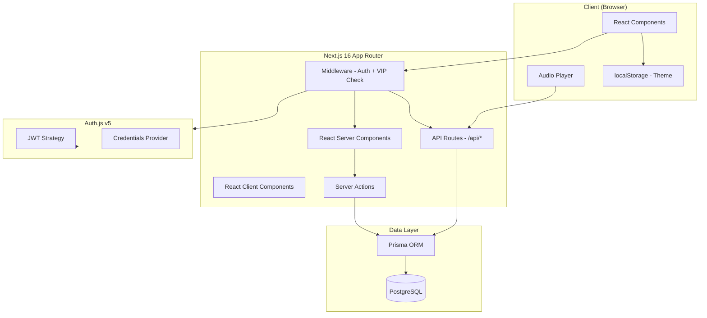
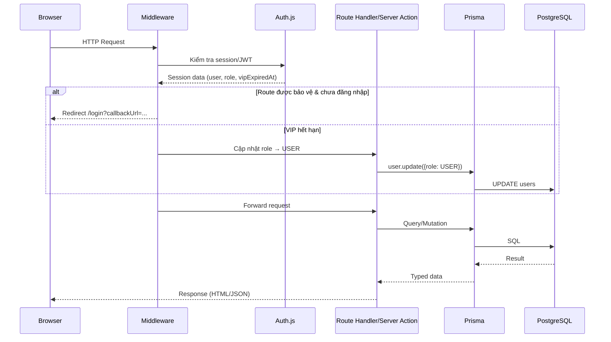
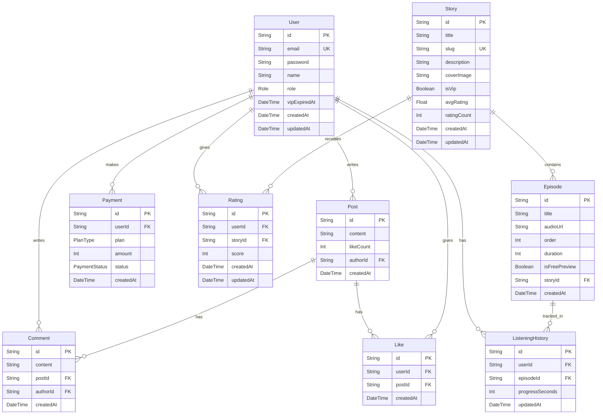

# Tài liệu Thiết kế — Nền tảng Truyện Audio

## Tổng quan

Nền tảng Truyện Audio là ứng dụng web sử dụng Next.js 16 App Router, React 19, TailwindCSS 4, Prisma ORM với PostgreSQL. Hệ thống cho phép người dùng duyệt, nghe truyện audio trực tuyến, quản lý tài khoản VIP, tham gia cộng đồng thảo luận, và thanh toán mock.

### Quyết định kỹ thuật chính

| Quyết định | Lựa chọn | Lý do |
|---|---|---|
| Authentication | NextAuth.js v5 (Auth.js) | Tích hợp sẵn với Next.js App Router, hỗ trợ JWT + session, middleware bảo vệ route dễ dàng, httpOnly cookie mặc định |
| ORM | Prisma | Yêu cầu từ requirements, type-safe, migration tự động |
| Database | PostgreSQL | Yêu cầu từ requirements, quan hệ phức tạp, ACID compliance |
| Styling | TailwindCSS 4 | Yêu cầu từ requirements, utility-first, responsive dễ dàng |
| Password hashing | bcryptjs | Thư viện nhẹ, không cần native bindings, phù hợp serverless |
| State management | React Context + Server Components | Tận dụng RSC của Next.js 16, giảm client-side JS |
| Audio player | HTML5 Audio API | Native browser API, không cần thư viện bên ngoài |
| Testing | Vitest + fast-check | Vitest cho unit test, fast-check cho property-based testing |

## Kiến trúc

### Kiến trúc tổng thể



### Luồng xử lý request



## Thành phần và Giao diện

### Cấu trúc thư mục

```
truyen-audio/
├── app/
│   ├── (auth)/
│   │   ├── login/page.tsx
│   │   ├── register/page.tsx
│   │   ├── forgot-password/page.tsx
│   │   └── reset-password/page.tsx
│   ├── (main)/
│   │   ├── layout.tsx              # Layout chung: Header + Footer
│   │   ├── page.tsx                # Trang chủ
│   │   ├── stories/
│   │   │   ├── page.tsx            # Danh sách truyện
│   │   │   └── [slug]/page.tsx     # Chi tiết truyện
│   │   ├── listen/
│   │   │   └── [episodeId]/page.tsx # Audio player
│   │   ├── vip/page.tsx            # Trang VIP
│   │   ├── community/
│   │   │   ├── page.tsx            # Danh sách bài viết
│   │   │   └── create/page.tsx     # Tạo bài viết
│   │   └── profile/page.tsx        # Hồ sơ cá nhân
│   ├── admin/
│   │   ├── layout.tsx
│   │   ├── stories/page.tsx
│   │   └── stories/create/page.tsx
│   ├── api/
│   │   ├── auth/[...nextauth]/route.ts
│   │   ├── stories/route.ts
│   │   ├── episodes/[episodeId]/route.ts
│   │   ├── listening-history/route.ts
│   │   ├── posts/route.ts
│   │   ├── posts/[postId]/comments/route.ts
│   │   ├── posts/[postId]/like/route.ts
│   │   ├── payments/route.ts
│   │   └── ratings/route.ts
│   ├── layout.tsx                  # Root layout
│   └── globals.css
├── components/
│   ├── ui/                         # Shared UI components
│   │   ├── Button.tsx
│   │   ├── Modal.tsx
│   │   ├── Input.tsx
│   │   └── Card.tsx
│   ├── layout/
│   │   ├── Header.tsx
│   │   ├── Footer.tsx
│   │   └── ThemeToggle.tsx
│   ├── stories/
│   │   ├── StoryCard.tsx
│   │   ├── StoryGrid.tsx
│   │   ├── EpisodeList.tsx
│   │   └── StoryFilter.tsx
│   ├── audio/
│   │   └── AudioPlayer.tsx
│   ├── community/
│   │   ├── PostCard.tsx
│   │   ├── PostForm.tsx
│   │   └── CommentSection.tsx
│   └── auth/
│       ├── LoginForm.tsx
│       └── RegisterForm.tsx
├── lib/
│   ├── auth.ts                     # Auth.js config
│   ├── prisma.ts                   # Prisma client singleton
│   ├── utils.ts                    # Utility functions
│   └── validations.ts              # Zod schemas
├── prisma/
│   ├── schema.prisma
│   └── seed.ts
├── types/
│   └── index.ts                    # Shared TypeScript types
└── middleware.ts                    # Next.js middleware
```


### Giao diện chính giữa các thành phần

#### 1. Auth.js Configuration (`lib/auth.ts`)

```typescript
// Credentials Provider với Prisma adapter
// JWT strategy lưu: userId, email, role, vipExpiredAt
// Callbacks: jwt() để gắn role/vipExpiredAt vào token, session() để expose ra client

interface SessionUser {
  id: string;
  email: string;
  role: "USER" | "VIP" | "ADMIN";
  vipExpiredAt: Date | null;
}
```

#### 2. Middleware (`middleware.ts`)

```typescript
// Xử lý 3 nhiệm vụ:
// 1. Bảo vệ route: /profile, /community/create, /listen/*, /admin/*
// 2. Kiểm tra VIP hết hạn: nếu role=VIP && vipExpiredAt < now → cập nhật role=USER
// 3. Kiểm tra quyền admin: /admin/* chỉ cho role=ADMIN

// Protected routes config
const protectedRoutes = ["/profile", "/community/create", "/listen"];
const adminRoutes = ["/admin"];
```

#### 3. API Routes Interface

| Route | Method | Mô tả | Auth |
|---|---|---|---|
| `/api/auth/[...nextauth]` | GET/POST | Auth.js handlers | No |
| `/api/stories` | GET | Danh sách truyện (filter, search, pagination) | No |
| `/api/stories` | POST | Tạo truyện mới | Admin |
| `/api/episodes/[episodeId]` | GET | Lấy thông tin tập + audioUrl | Conditional |
| `/api/listening-history` | GET/POST | Lấy/lưu tiến trình nghe | Yes |
| `/api/posts` | GET/POST | Danh sách/tạo bài viết | GET: No, POST: Yes |
| `/api/posts/[postId]/comments` | GET/POST | Bình luận bài viết | GET: No, POST: Yes |
| `/api/posts/[postId]/like` | POST/DELETE | Thích/bỏ thích bài viết | Yes |
| `/api/payments` | POST | Thanh toán mock VIP | Yes |
| `/api/ratings` | POST | Đánh giá truyện | Yes |

#### 4. Server Actions

```typescript
// app/actions/auth.ts
async function registerUser(data: RegisterInput): Promise<ActionResult>
async function resetPassword(token: string, password: string): Promise<ActionResult>

// app/actions/stories.ts  
async function createStory(data: StoryInput): Promise<ActionResult>
async function createEpisode(storyId: string, data: EpisodeInput): Promise<ActionResult>

// app/actions/community.ts
async function createPost(data: PostInput): Promise<ActionResult>
async function createComment(postId: string, content: string): Promise<ActionResult>
async function toggleLike(postId: string): Promise<ActionResult>
async function deletePost(postId: string): Promise<ActionResult>
async function deleteComment(commentId: string): Promise<ActionResult>

// app/actions/payment.ts
async function purchaseVip(plan: "WEEK" | "MONTH" | "YEAR"): Promise<ActionResult>

// app/actions/listening.ts
async function saveProgress(episodeId: string, progressSeconds: number): Promise<ActionResult>
async function getProgress(episodeId: string): Promise<number | null>
```

#### 5. AudioPlayer Component Interface

```typescript
interface AudioPlayerProps {
  episode: {
    id: string;
    title: string;
    audioUrl: string;
    duration: number;
    story: { title: string; slug: string };
  };
  initialProgress?: number;  // Vị trí đã lưu (giây)
  isPreviewOnly?: boolean;   // Giới hạn 5 phút cho guest
}

// Sử dụng HTML5 Audio API
// Events: onTimeUpdate → debounce save progress mỗi 10 giây
// onPause, onBeforeUnload → save progress ngay lập tức
// Playback rates: [0.5, 0.75, 1, 1.25, 1.5, 2]
// Skip forward/backward: 15 giây
```

## Mô hình Dữ liệu

### Prisma Schema



### Chi tiết Prisma Schema

```prisma
generator client {
  provider = "prisma-client-js"
}

datasource db {
  provider = "postgresql"
  url      = env("DATABASE_URL")
}

enum Role {
  USER
  VIP
  ADMIN
}

enum PlanType {
  WEEK
  MONTH
  YEAR
}

enum PaymentStatus {
  SUCCESS
  FAILED
}

model User {
  id             String    @id @default(cuid())
  email          String    @unique
  password       String
  name           String?
  role           Role      @default(USER)
  vipExpiredAt   DateTime?
  createdAt      DateTime  @default(now())
  updatedAt      DateTime  @updatedAt

  posts             Post[]
  comments          Comment[]
  payments          Payment[]
  listeningHistory  ListeningHistory[]
  likes             Like[]
  ratings           Rating[]
}

model Story {
  id          String    @id @default(cuid())
  title       String
  slug        String    @unique
  description String
  coverImage  String
  isVip       Boolean   @default(false)
  avgRating   Float     @default(0)
  ratingCount Int       @default(0)
  createdAt   DateTime  @default(now())
  updatedAt   DateTime  @updatedAt

  episodes Episode[]
  ratings  Rating[]
}

model Episode {
  id            String   @id @default(cuid())
  title         String
  audioUrl      String
  order         Int
  duration      Int      // seconds
  isFreePreview Boolean  @default(false)
  storyId       String
  createdAt     DateTime @default(now())

  story            Story              @relation(fields: [storyId], references: [id], onDelete: Cascade)
  listeningHistory ListeningHistory[]

  @@unique([storyId, order])
}

model Post {
  id        String   @id @default(cuid())
  content   String
  likeCount Int      @default(0)
  authorId  String
  createdAt DateTime @default(now())

  author   User      @relation(fields: [authorId], references: [id], onDelete: Cascade)
  comments Comment[]
  likes    Like[]
}

model Comment {
  id        String   @id @default(cuid())
  content   String
  postId    String
  authorId  String
  createdAt DateTime @default(now())

  post   Post @relation(fields: [postId], references: [id], onDelete: Cascade)
  author User @relation(fields: [authorId], references: [id], onDelete: Cascade)
}

model Like {
  id        String   @id @default(cuid())
  userId    String
  postId    String
  createdAt DateTime @default(now())

  user User @relation(fields: [userId], references: [id], onDelete: Cascade)
  post Post @relation(fields: [postId], references: [id], onDelete: Cascade)

  @@unique([userId, postId])
}

model Payment {
  id        String        @id @default(cuid())
  userId    String
  plan      PlanType
  amount    Int
  status    PaymentStatus
  createdAt DateTime      @default(now())

  user User @relation(fields: [userId], references: [id], onDelete: Cascade)
}

model ListeningHistory {
  id              String   @id @default(cuid())
  userId          String
  episodeId       String
  progressSeconds Int      @default(0)
  updatedAt       DateTime @updatedAt

  user    User    @relation(fields: [userId], references: [id], onDelete: Cascade)
  episode Episode @relation(fields: [episodeId], references: [id], onDelete: Cascade)

  @@unique([userId, episodeId])
}

model Rating {
  id        String   @id @default(cuid())
  userId    String
  storyId   String
  score     Int      // 1-5
  createdAt DateTime @default(now())
  updatedAt DateTime @updatedAt

  user  User  @relation(fields: [userId], references: [id], onDelete: Cascade)
  story Story @relation(fields: [storyId], references: [id], onDelete: Cascade)

  @@unique([userId, storyId])
}
```

### Validation Schemas (Zod)

```typescript
// lib/validations.ts
import { z } from "zod";

export const registerSchema = z.object({
  email: z.string().email("Email không hợp lệ"),
  password: z.string().min(6, "Mật khẩu phải có ít nhất 6 ký tự"),
  name: z.string().optional(),
});

export const loginSchema = z.object({
  email: z.string().email("Email không hợp lệ"),
  password: z.string().min(1, "Vui lòng nhập mật khẩu"),
});

export const storyFilterSchema = z.object({
  genre: z.string().optional(),
  status: z.enum(["all", "free", "vip"]).default("all"),
  search: z.string().optional(),
  page: z.coerce.number().int().positive().default(1),
});

export const postSchema = z.object({
  content: z.string().min(1, "Nội dung không được để trống").max(5000),
});

export const commentSchema = z.object({
  content: z.string().min(1, "Bình luận không được để trống").max(2000),
});

export const ratingSchema = z.object({
  score: z.number().int().min(1).max(5),
});

export const storyCreateSchema = z.object({
  title: z.string().min(1),
  slug: z.string().min(1).regex(/^[a-z0-9-]+$/),
  description: z.string().min(1),
  coverImage: z.string().url(),
  isVip: z.boolean().default(false),
});

export const episodeCreateSchema = z.object({
  title: z.string().min(1),
  audioUrl: z.string().url(),
  order: z.number().int().positive(),
  duration: z.number().int().positive(),
  isFreePreview: z.boolean().default(false),
});
```


## Thuộc tính Đúng đắn (Correctness Properties)

*Một thuộc tính (property) là một đặc điểm hoặc hành vi phải luôn đúng trong mọi lần thực thi hợp lệ của hệ thống — về cơ bản là một phát biểu hình thức về những gì hệ thống phải làm. Các thuộc tính đóng vai trò cầu nối giữa đặc tả dễ đọc cho con người và đảm bảo tính đúng đắn có thể kiểm chứng bằng máy.*

### Property 1: Đăng ký tạo user với role USER

*Với mọi* email hợp lệ (chưa tồn tại) và mật khẩu hợp lệ (≥ 6 ký tự), gọi hàm đăng ký phải tạo user mới trong database với role = USER.

**Validates: Requirements 1.1**

### Property 2: Mật khẩu được hash trước khi lưu

*Với mọi* mật khẩu hợp lệ, sau khi đăng ký, giá trị password trong database phải khác mật khẩu gốc và phải verify thành công bằng bcrypt.compare().

**Validates: Requirements 1.4**

### Property 3: Email trùng bị từ chối

*Với mọi* email đã tồn tại trong database, gọi hàm đăng ký với email đó phải trả về lỗi và không tạo user mới.

**Validates: Requirements 1.2**

### Property 4: Mật khẩu ngắn bị từ chối

*Với mọi* chuỗi có độ dài < 6 ký tự, validation schema phải reject và không cho phép đăng ký.

**Validates: Requirements 1.3**

### Property 5: Đăng nhập đúng trả về session

*Với mọi* user đã đăng ký, đăng nhập với đúng email và mật khẩu phải trả về session chứa userId, email, và role.

**Validates: Requirements 2.1**

### Property 6: Đăng nhập sai bị từ chối

*Với mọi* cặp email/mật khẩu không khớp với bất kỳ user nào, đăng nhập phải trả về lỗi và không tạo session.

**Validates: Requirements 2.2**

### Property 7: Đăng xuất xóa session

*Với mọi* session hợp lệ, sau khi đăng xuất, session đó phải không còn hợp lệ.

**Validates: Requirements 3.1**

### Property 8: Quên mật khẩu không tiết lộ email tồn tại

*Với mọi* email (tồn tại hoặc không), response từ hàm quên mật khẩu phải có cùng format và không cho phép phân biệt email có tồn tại hay không.

**Validates: Requirements 4.2**

### Property 9: Đặt lại mật khẩu round-trip

*Với mọi* token reset hợp lệ và mật khẩu mới, sau khi reset, đăng nhập với mật khẩu mới phải thành công và đăng nhập với mật khẩu cũ phải thất bại.

**Validates: Requirements 4.3**

### Property 10: Middleware bảo vệ route cho user chưa đăng nhập

*Với mọi* route trong danh sách protected routes, request không có session hợp lệ phải bị redirect đến /login với callbackUrl chứa route gốc.

**Validates: Requirements 5.1**

### Property 11: Middleware cho phép user đã đăng nhập

*Với mọi* route trong danh sách protected routes, request có session hợp lệ phải được cho phép truy cập.

**Validates: Requirements 5.2**

### Property 12: Token hết hạn bị từ chối

*Với mọi* token đã hết hạn, middleware phải xóa token và redirect đến /login.

**Validates: Requirements 5.3**

### Property 13: Trang chủ giới hạn tối đa 8 items mỗi section

*Với mọi* tập dữ liệu truyện (bất kể số lượng), mỗi section trên trang chủ (nổi bật, mới cập nhật, miễn phí) phải trả về tối đa 8 items, và section miễn phí chỉ chứa truyện có isVip = false, section mới cập nhật phải sắp xếp theo createdAt giảm dần.

**Validates: Requirements 6.2, 6.3, 6.4**

### Property 14: Filter truyện theo trạng thái

*Với mọi* tập dữ liệu truyện, filter "free" chỉ trả về truyện có isVip = false, filter "vip" chỉ trả về truyện có isVip = true, filter "all" trả về tất cả.

**Validates: Requirements 7.3**

### Property 15: Tìm kiếm truyện không phân biệt hoa thường

*Với mọi* từ khóa tìm kiếm và tập dữ liệu truyện, tất cả kết quả trả về phải chứa từ khóa trong tên truyện (case-insensitive), và không bỏ sót truyện nào có tên chứa từ khóa.

**Validates: Requirements 7.4**

### Property 16: Phân trang tối đa 12 items

*Với mọi* tập dữ liệu truyện và số trang hợp lệ, mỗi trang trả về tối đa 12 items.

**Validates: Requirements 7.5**

### Property 17: Danh sách tập sắp xếp theo order tăng dần

*Với mọi* truyện có nhiều tập, danh sách tập trả về phải sắp xếp theo trường order tăng dần.

**Validates: Requirements 8.1**

### Property 18: VIP user truy cập mọi tập

*Với mọi* user có role VIP (và vipExpiredAt > now) và mọi episode, hàm kiểm tra quyền truy cập phải trả về true.

**Validates: Requirements 8.5**

### Property 19: Kiểm tra quyền nghe — non-VIP bị chặn tập VIP

*Với mọi* user có role USER và mọi episode có isFreePreview = false thuộc truyện VIP, hàm kiểm tra quyền truy cập phải trả về false.

**Validates: Requirements 9.6**

### Property 20: Tiến trình nghe round-trip

*Với mọi* user đã đăng nhập, episodeId, và giá trị progressSeconds hợp lệ, lưu tiến trình rồi đọc lại phải trả về cùng giá trị progressSeconds.

**Validates: Requirements 9.4, 9.5**

### Property 21: Thanh toán VIP thành công cập nhật role và vipExpiredAt

*Với mọi* user có role USER và plan type (WEEK/MONTH/YEAR), sau khi thanh toán mock thành công, user phải có role = VIP và vipExpiredAt được đặt đúng theo thời hạn gói (7 ngày / 30 ngày / 365 ngày từ thời điểm thanh toán).

**Validates: Requirements 10.3**

### Property 22: Thanh toán thất bại không thay đổi role

*Với mọi* user và thanh toán mock thất bại, role và vipExpiredAt của user phải giữ nguyên giá trị trước khi thanh toán.

**Validates: Requirements 10.5**

### Property 23: VIP hết hạn bị hạ cấp về USER

*Với mọi* user có role VIP và vipExpiredAt < thời điểm hiện tại, sau khi middleware xử lý, role phải được cập nhật thành USER và vipExpiredAt phải bị xóa (null).

**Validates: Requirements 11.1, 11.2**

### Property 24: Like/Unlike round-trip

*Với mọi* bài viết và user đã đăng nhập, like rồi unlike phải đưa likeCount trở về giá trị ban đầu.

**Validates: Requirements 12.4, 12.5**

### Property 25: Bài viết sắp xếp theo ngày giảm dần

*Với mọi* tập bài viết, danh sách trả về phải sắp xếp theo createdAt giảm dần.

**Validates: Requirements 12.1**

### Property 26: Tạo bài viết với nội dung hợp lệ

*Với mọi* nội dung hợp lệ (1-5000 ký tự) và user đã đăng nhập, tạo post phải thành công và post mới phải tồn tại trong database với đúng content và authorId.

**Validates: Requirements 12.2**

### Property 27: Tạo bình luận liên kết đúng bài viết

*Với mọi* bài viết tồn tại, nội dung hợp lệ, và user đã đăng nhập, tạo comment phải thành công và comment mới phải có đúng postId và authorId.

**Validates: Requirements 12.3**

### Property 28: User history trả về đúng dữ liệu

*Với mọi* user đã đăng nhập, query listening history phải trả về đúng các bản ghi ListeningHistory của user đó (không lẫn dữ liệu user khác), và query payment history phải trả về đúng các bản ghi Payment của user đó.

**Validates: Requirements 13.3, 13.4**

### Property 29: Episode JSON round-trip

*Với mọi* Episode hợp lệ từ database, serialize thành JSON rồi parse lại phải tạo ra object tương đương với giá trị ban đầu.

**Validates: Requirements 14.4**

### Property 30: Theme preference round-trip

*Với mọi* giá trị theme (light/dark), lưu vào localStorage rồi đọc lại phải trả về cùng giá trị.

**Validates: Requirements 16.2, 16.3**

### Property 31: Admin tạo truyện thành công

*Với mọi* dữ liệu truyện hợp lệ (title, slug duy nhất, description, coverImage, isVip) và user có role ADMIN, tạo story phải thành công và story mới phải tồn tại trong database với đúng thông tin.

**Validates: Requirements 17.2**

### Property 32: Admin tạo tập thành công

*Với mọi* dữ liệu tập hợp lệ (title, audioUrl, order, duration, isFreePreview) và story tồn tại, tạo episode phải thành công và episode mới phải liên kết đúng storyId.

**Validates: Requirements 17.3**

### Property 33: Non-admin bị chặn route admin

*Với mọi* user có role khác ADMIN, truy cập route /admin/* phải bị redirect về trang chủ.

**Validates: Requirements 17.4**

### Property 34: Đánh giá cập nhật điểm trung bình chính xác

*Với mọi* tập hợp đánh giá (1-5 sao) trên một truyện, avgRating phải bằng trung bình cộng của tất cả scores, và ratingCount phải bằng tổng số đánh giá. Khi user cập nhật đánh giá, avgRating phải được tính lại chính xác.

**Validates: Requirements 18.1, 18.2**


## Xử lý Lỗi

### Chiến lược xử lý lỗi theo tầng

| Tầng | Loại lỗi | Cách xử lý |
|---|---|---|
| Validation (Zod) | Input không hợp lệ | Trả về 400 với danh sách lỗi cụ thể từng field |
| Authentication | Chưa đăng nhập / token hết hạn | Redirect đến /login với callbackUrl |
| Authorization | Không đủ quyền (VIP, Admin) | Trả về 403 hoặc redirect với thông báo |
| Database (Prisma) | Unique constraint violation | Trả về 409 với thông báo "đã tồn tại" |
| Database (Prisma) | Record not found | Trả về 404 |
| Database (Prisma) | Connection error | Trả về 500 với thông báo chung, log chi tiết server-side |
| Payment mock | Thanh toán thất bại | Trả về 400, không thay đổi role, hiển thị thông báo lỗi |
| Audio | File không tải được | Hiển thị thông báo lỗi trên player, cho phép retry |
| General | Lỗi không xác định | Trả về 500 với thông báo chung, log error |

### Error Response Format

```typescript
// Chuẩn hóa response lỗi cho API routes
interface ApiError {
  error: string;           // Mã lỗi ngắn gọn
  message: string;         // Thông báo hiển thị cho user
  details?: Record<string, string[]>; // Chi tiết validation errors
}

// Ví dụ:
// 400: { error: "VALIDATION_ERROR", message: "Dữ liệu không hợp lệ", details: { email: ["Email không hợp lệ"] } }
// 401: { error: "UNAUTHORIZED", message: "Vui lòng đăng nhập" }
// 403: { error: "FORBIDDEN", message: "Bạn không có quyền truy cập" }
// 404: { error: "NOT_FOUND", message: "Không tìm thấy tài nguyên" }
// 409: { error: "CONFLICT", message: "Email đã được sử dụng" }
// 500: { error: "INTERNAL_ERROR", message: "Đã xảy ra lỗi, vui lòng thử lại" }
```

### Xử lý lỗi phía Client

- Sử dụng React Error Boundary cho lỗi render
- `error.tsx` trong mỗi route segment cho lỗi server component
- `not-found.tsx` cho trang 404
- Toast notifications cho lỗi từ Server Actions và API calls
- Form validation hiển thị lỗi inline dưới mỗi field

### Bảo mật trong xử lý lỗi

- Không tiết lộ thông tin nhạy cảm trong error messages (ví dụ: quên mật khẩu không cho biết email có tồn tại)
- Log chi tiết lỗi server-side, chỉ trả về thông báo chung cho client
- Rate limiting cho các endpoint nhạy cảm (login, register, forgot-password)

## Chiến lược Kiểm thử

### Tổng quan

Dự án sử dụng chiến lược kiểm thử kép (dual testing approach):

1. **Unit tests (Vitest)**: Kiểm tra các ví dụ cụ thể, edge cases, và error conditions
2. **Property-based tests (Vitest + fast-check)**: Kiểm tra các thuộc tính phổ quát trên nhiều input ngẫu nhiên

Cả hai loại test đều cần thiết và bổ sung cho nhau:
- Unit tests bắt lỗi cụ thể, dễ debug
- Property tests phát hiện edge cases mà developer không nghĩ tới

### Thư viện kiểm thử

| Thư viện | Mục đích |
|---|---|
| `vitest` | Test runner, assertion library |
| `fast-check` | Property-based testing |
| `@testing-library/react` | Component testing |
| `msw` (Mock Service Worker) | Mock API calls |

### Cấu hình Property-Based Testing

- Mỗi property test phải chạy tối thiểu **100 iterations**
- Mỗi property test phải có comment tham chiếu đến property trong design document
- Format tag: **Feature: truyen-audio-platform, Property {number}: {property_text}**
- Mỗi correctness property phải được implement bởi **MỘT** property-based test duy nhất

### Phân loại test theo tầng

#### Unit Tests (ví dụ cụ thể và edge cases)

- **Validation**: Test Zod schemas với các input cụ thể (email hợp lệ/không hợp lệ, mật khẩu ngắn)
- **Auth flow**: Test đăng ký/đăng nhập với dữ liệu mẫu cụ thể
- **API routes**: Test response format, status codes cho các trường hợp cụ thể
- **Middleware**: Test redirect behavior cho các route cụ thể
- **Audio player**: Test preview limit (5 phút), playback rate changes
- **Payment mock**: Test tạo payment record, VIP expiration dates cụ thể

#### Property-Based Tests (thuộc tính phổ quát)

Mỗi property trong phần "Thuộc tính Đúng đắn" phải có một property test tương ứng:

- **Property 1-4**: Generators cho email, password → test registration logic
- **Property 5-6**: Generators cho credentials → test login logic
- **Property 7**: Generator cho sessions → test logout
- **Property 8-9**: Generators cho email, reset tokens → test password reset
- **Property 10-12**: Generators cho routes, sessions → test middleware
- **Property 13**: Generator cho danh sách stories → test homepage queries
- **Property 14-16**: Generators cho filter params, stories → test story listing
- **Property 17**: Generator cho episodes → test ordering
- **Property 18-19**: Generators cho users, episodes → test access control
- **Property 20**: Generators cho episodeId, progressSeconds → test listening history round-trip
- **Property 21-22**: Generators cho plan types → test payment flow
- **Property 23**: Generators cho VIP users với expired dates → test VIP expiration
- **Property 24-27**: Generators cho posts, comments → test community features
- **Property 28**: Generators cho users với history → test profile data
- **Property 29**: Generator cho Episode objects → test JSON round-trip
- **Property 30**: Generator cho theme values → test localStorage round-trip
- **Property 31-33**: Generators cho story/episode data, user roles → test admin features
- **Property 34**: Generators cho ratings (1-5) → test average calculation

### Cấu trúc thư mục test

```
truyen-audio/
├── __tests__/
│   ├── unit/
│   │   ├── validations.test.ts
│   │   ├── auth.test.ts
│   │   ├── middleware.test.ts
│   │   ├── stories.test.ts
│   │   ├── audio.test.ts
│   │   ├── community.test.ts
│   │   └── payment.test.ts
│   └── properties/
│       ├── auth.property.test.ts
│       ├── middleware.property.test.ts
│       ├── stories.property.test.ts
│       ├── audio.property.test.ts
│       ├── community.property.test.ts
│       ├── payment.property.test.ts
│       ├── vip.property.test.ts
│       ├── admin.property.test.ts
│       ├── profile.property.test.ts
│       └── serialization.property.test.ts
```

### Ví dụ Property Test

```typescript
// __tests__/properties/auth.property.test.ts
import { test } from "vitest";
import fc from "fast-check";

// Feature: truyen-audio-platform, Property 2: Mật khẩu được hash trước khi lưu
test("password is hashed before storage", () => {
  fc.assert(
    fc.property(
      fc.string({ minLength: 6, maxLength: 100 }),
      async (password) => {
        const hashed = await hashPassword(password);
        expect(hashed).not.toBe(password);
        expect(await verifyPassword(password, hashed)).toBe(true);
      }
    ),
    { numRuns: 100 }
  );
});

// Feature: truyen-audio-platform, Property 29: Episode JSON round-trip
test("episode JSON serialization round-trip", () => {
  fc.assert(
    fc.property(
      episodeArbitrary,
      (episode) => {
        const json = JSON.stringify(episode);
        const parsed = JSON.parse(json);
        expect(parsed).toEqual(episode);
      }
    ),
    { numRuns: 100 }
  );
});
```
